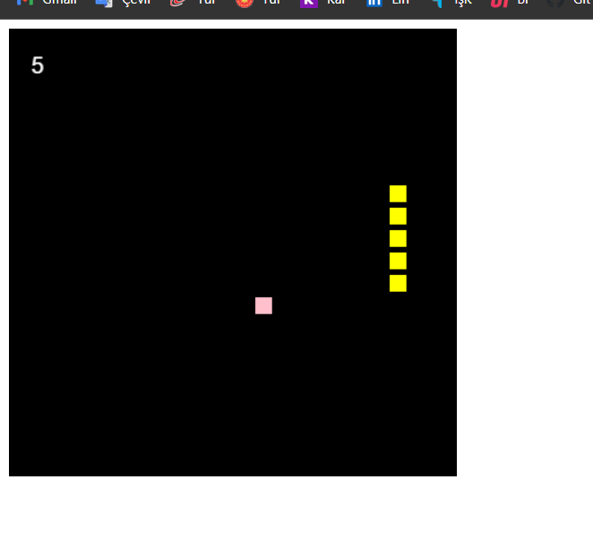
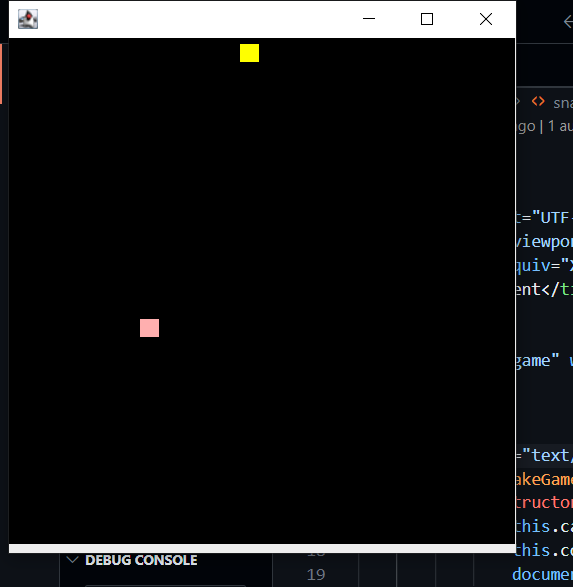

<h1>Yılan Oyunu</h1>

	<h2>Java kodu için</h2>
	

		Kodumu iki class ile hazırladım. Classlar: 
		<ul>	
			<li>snakeGame</li>
			<li>again</li>
		</ul>
	 	snakeGame'de oyun içi ayarları JFrame yi çağırdım.
		againde ise oyunun update kısmını yani sürekli yenilenen hesaplamaları yaptım. oyun durmadan çalışmasını sağladım.
		Oyun mantığını Selman Kahyan'ın  Youtube videosundan aldım.
		Oyunu Çalıştırmak için önce  javayı yükleyin. 
		Sonra terminalden:
		<ul>
			<li>
				<code>cd ./java-code</code> 
			</li>
			<li>
				<code>javac snakeGame.java</code>
			</li>
			<li>	
				<code>java snakeGame</code>
			</li>
		</ul>
		sırası ile çalıştırın.	
	

### Preview

